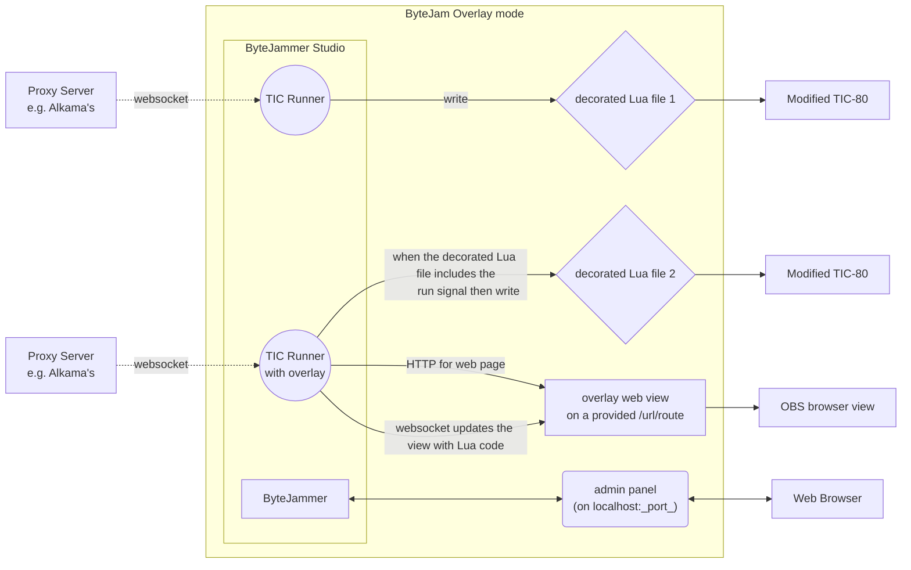
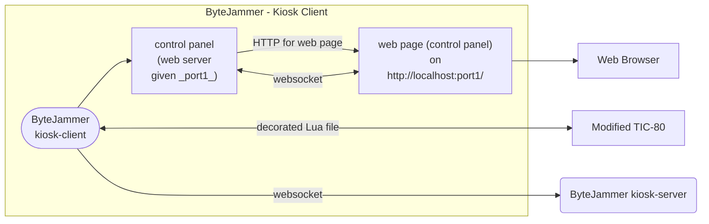
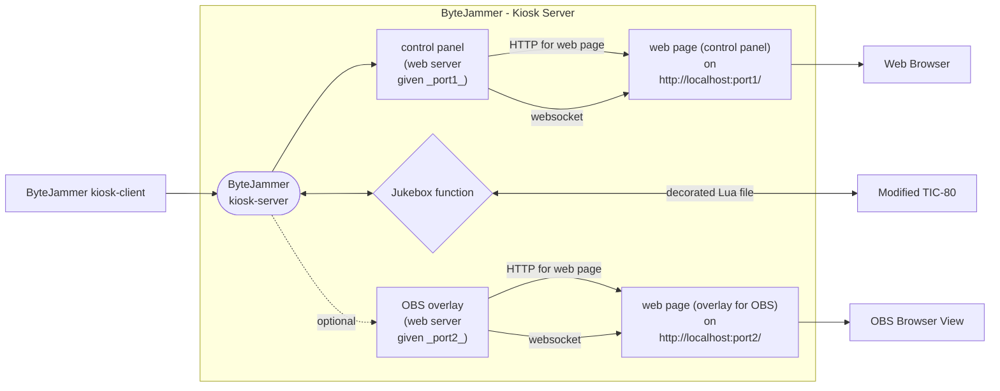

# ByteJammer v2

This is a rebuild / experimental build. I'll almost certainly eventually collapse it into the [ByteJammer v1](https://github.com/creativenucleus/bytejammer2) repo.

This project is **NOT** ready for outside contributions just now, but that time will come!  

[Latest Code and documentation - GitHub](https://github.com/creativenucleus/bytejammer2)

For celebration of the TIC-80 livecoding / effects scene.

- A jukebox / robot VJ that plays TIC-80 effects for personal enjoyment.
- A standalone client-server for running ByteJams.
- A client and server for running the ByteWall.

Please read the documentation before running.

### **IMPORTANT**

This is a work in progress **USE AT YOUR OWN RISK**. It's currently early days, so things are more likely to go wrong, but [so far] nobody has reported any ill effects.

Features should currently be considered experimental, and liable to change, possibly in a way that is not backward compatible. The format of arguments for the CLI is likely to be particularly in flux, and this documentation may lag behind development (I tend to code chunks, and periodically review docs). Please feel welcome to contact me if you have questions.

## Setup

A config.json file is required.  

An example _config.json file is provided. Please remove the underscore from the filename and edit that file as appropriate.

Please note: Some functionality requires a [custom version of the Bytebattle build](https://github.com/creativenucleus/TIC-80-bytebattle) that permits reading AND writing from the filesystem (the standard version permits reading OR writing).

### Example config.json

```json
{
    "work_dir": "./_bytejammer-data",
    "control_panel": {
        "port": 9000
    },
    "runnables": {
        "tic-80-client": {
            "filepath": "./tics/old-bytejammer-build/tic80-win.exe",
            "args": [
                "--skip"
            ]
        },
        "tic-80-server": {
            "filepath": "./tics/old-bytejammer-build/tic80-win.exe",
            "args": [
                "--skip",
                "--scale=2"
            ]
        }
    },
    "jukebox": {
        "rotate_period_in_seconds": 15
    }
}
```

## Studio Mode - Bytejam TIC Runner (with and without overlay)

This feature is managed by starting in `studio` mode.

You'll need to have a json.config (but so far only `work_dir` matters)

This mode watches a decorated Lua file (*), reading changes, and does two things:
- Writes a modified 'running' version for server TIC to ingest (the one with `--codeimport`).
- Outputs an updating web page that displays the source code.

(*) 'a decorated Lua file' refers to the data that we send over a web connection from client to server (i.e. a cursor/run-signal header followed by plain sourcecode).



It will take the following arguments:
- `--port` - (required) the admin panel and overlays will be served from `http://localhost:PORT`

So will be invoked like:

`bytejammer2.exe studio --port 8001`

Running it will look something like:

#### Server

In the web panel, provide a websocket URL to listen to (i.e. `ws://[alkamas-server]/room/user`) and a Player Name.

The player name will be turned into a no-spaces, valid character slug, which becomes an overlay URL, and a file for the TIC to watch.

Check your fft settings, etc, for live.

```cli
# Start ticws, listening to a websocket and dumping the data to the file system
.\ticws-server.exe bytejamobs yourname bytejamobs-ticws-output.dat

(Run ByteJammer in Studio mode and Launch a TIC Overlay)

# Run a TIC, watching the modified file
.\tic80.exe --skip --codeimport=bytejamobs-running.dat --delay=5 --fft --fftcaptureplaybackdevices 
```

#### Client (if you want to do local testing)

```cli
# Start a TIC, exporting the code to the file system
.\tic80.exe --skip --codeexport=bytejamobs-ticws-client.dat --delay=5 --fft --fftcaptureplaybackdevices

# Start ticws, watching that file, and sending it over a web socket
.\ticws-client.exe bytejamobs yourname bytejamobs-ticws-client.dat
```

You MUST open a browser listening to the that PORT (8001 in the example) for all the flow to work!

This build of ByteJammer has some quality-of-life issues, namely:
- Sometimes it, or a TIC becomes unquittable (CTRL-C won't work), and needs to be hard closed with Task Manager / OS equivalent. For this reason, while we are beta testing it, I recommend **just running one player with source code** - if it misbehaves then it's easier to know which process to shut down!
- The print log sometimes works; sometimes it doesn't track well, or spews whitespace.
- There can only be one browser viewing of the source code served on any specific port. The latest viewer will take control.
- If the client hasn't typed for a while (10 seconds), "Source file bytejamobs-ticws-output.dat is empty" will be raised, but that'll disappear when the client types again.

### OBS Studio Setup

OBS Studio can be set with a 'Browser' Source. The URL should be set to watch the localhost with the provided port, e.g. `http://localhost:8001/`

In the browser settings, you may need to hit the 'Refresh cache of current page' button if the source is not the current attached browser.

## Running a ByteWall

Put `attractmode.lua` in the `_bytejammer-data/kiosk-server-playlist` folder (you might have to run once for that folder to be created).

The ByteWall requires a client (this is the on the machine your players will use to code) and a server (this is the machine that receives submissions and plays them as a jukebox). They could be running on the same machine.

### ByteWall Kiosk-Client

```cli
.\bytejammer2.exe kiosk-client (arguments)
```

(this launches a webpanel available at http://localhost:9000, or at the port specified in the config.json)



#### Arguments

##### --url ws://localhost:8900/kiosk/listener

The URL to attach to in order to communicate with the server.

##### --startercodepath ./startercode.lua

### Bytewall Kiosk-Server

```cli
.\bytejammer2.exe kiosk-server (arguments)
```



#### Arguments

##### --connection: host or client

The server can run as a websocket hub (HOST mode) or you can use a third party intermediate to connect server and client (CLIENT mode).

HOST - Runs an in-built websocket server - You need to supply `port` and `endpoint`:

`--connection host --port 8900 --endpoint /kiosk/listener`

CLIENT - uses another service to proxy the websockets - Supply the URL:

`--connection client --url ws://drone.alkama.com:9000/bytejammer/someurl`

##### --obs-overlay-port PORT

`--obs-overlay-port 4000` will serve a webpage from `http://localhost:4000`. This webpage will continually update to show the player name and effect name for the effect currently playing on the jukebox TIC.

### Example

A local ByteWall on one machine might be run by:

```cli
.\bytejammer2.exe kiosk-server --connection host --port 8900 --endpoint /kiosk/listener

.\bytejammer2.exe kiosk-client --url ws://localhost:8900/kiosk/listener
```

## Goals

- Decent functionality from low configuration  
Ideally, the UI to do things at a basic level should be as light / easy to start as possible.
- Compatibility  
There are a number of tools in the livecoding/TIC/websocket ecosystem. Aim to be compatible.
- Augmentation  
Ensure the ByteJammer adds value to the ecosystem.
- Composability  
Providing a selection of components that can be glued together to allow unanticipated interactions.

## Ideas for Components to Implement

- Abstraction of connections between things so that they may be transparently websocket or internal.
- MessagePipe  
Flows one way
- ExeLauncher  
Decide whether to bundle executables (e.g. websocket-compliant versions of TIC), as well as having them linkable.
- FileObserver  
Reads a file every X seconds
Broadcast a Message on Change  
- FileProvider  
An abstraction of a file system?

## TODO

Template for all HTML panels.


